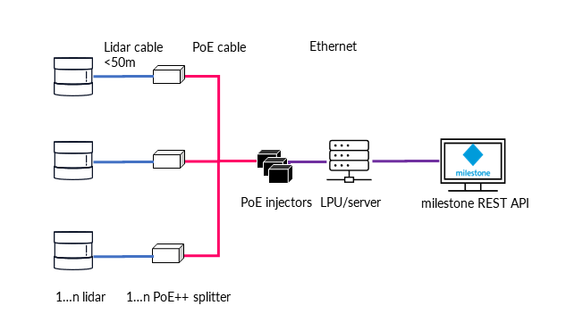

# 2. Flasheye Security Solution

> This section describes what the solution consists of and background of the used technology and compatibility.

Flasheye’s security solution consists of:
- One or several 3D LiDAR sensors for collecting the raw data
- LPU (LiDAR processing unit), or a server solution for efficient data processing at the premises
- Web interface for easy configuration and live viewing on almost any smart device
- Diverse 3rd party interfaces for external system integration

  

The security system can be configured either as a single-sensor system with one LiDAR sensor and Flasheye’s robust outdoor LiDAR processing unit or as a multi-sensor system with several LiDAR sensors connected to a rack mounted server solution, especially when a bigger area needs to be monitored and covered.

## The Sensor Technology

LiDAR (Light Detection and Ranging) is similar to radar but instead of using radio waves, the time of flight (ToF) of photons is measured, meaning the time elapsed until reception of a reflection of a laser pulse from the surface of an object. Millions of rapid measurements create a point cloud representing a 3D model in real-time. Based on the 3D point cloud, we can detect movements from objects, changes, and shapes in the monitored volume. Flasheye’s solution is compatible with world-leading LiDAR manufacturers’ sensors. This allows us to select the optimal sensor based on criteria such as range, field of view, resolution, or outdoor robustness. 

  

## What is Included

Flasheye’s security solution includes LiDAR sensors, LPU’s or a server, and our software that is familiar to users of other alarm systems for cameras. The sensors can be placed on pillars, walls, roofs, ceilings, etc. for optimized coverage of the region of interest. The software solution allows the configuration of virtual 3D boxes created for the areas/volumes the customer wants to monitor. Each virtual box can have different rules dependent on its purpose, and they may overlap. The virtual 3D boxes and rules can be easily created and modified through the Web user interface. 

  

