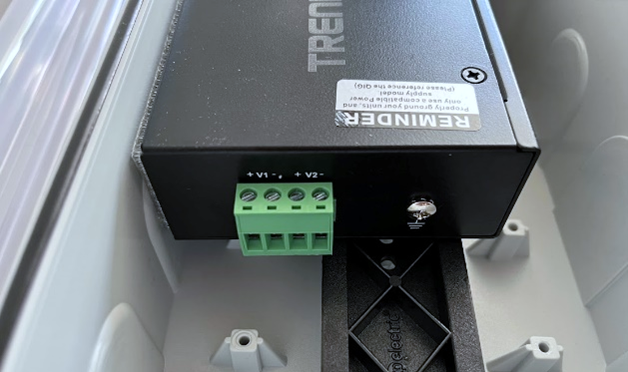
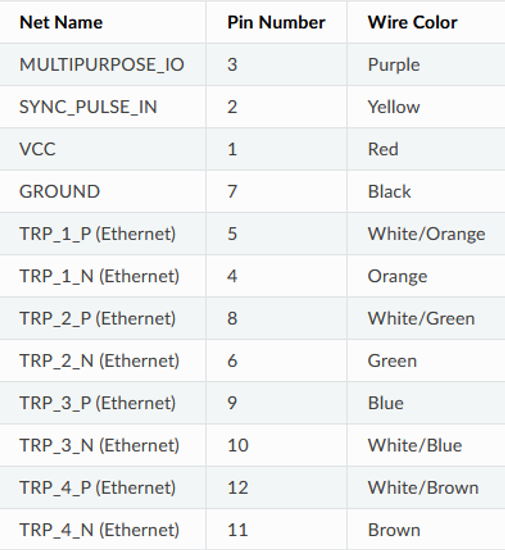
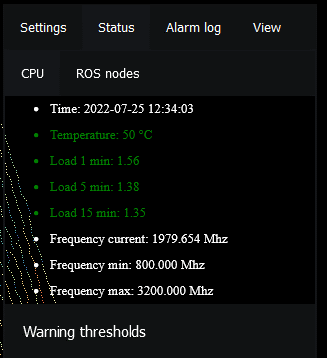

# 6. Getting Started

> This guide will help you get started and deploy the infrastructure and Flasheye security solution so you can start using your system. Do you have any issues? Check out our Support section.

__NOTE: The Getting Started section describes _only_ the single-sensor security solution installation.__

## General consideration
Before you begin, consider the following requirements:

- Network infrastructure with DHCP router for network communication (Optional: 4G modem in LPU may be used)

- Computer for identifying IP-addresses of connected equipment

- Gigabit PoE cable for server installations (length depending on positioning the equipment)

- Gigabit Ethernet cable and 8-wire RJ45 connector

- External mains power (110-230V) for the server or LPU

- Planning the positions of the LiDAR sensors to be optimal for coverage and surveillance

## Meeting your Security Solution
Unbox the delivery from Flasheye consisting of:

|  |
|:--:|
| <b>LPU and power connector
IP65-classed LPU (when special cable gland is fitted over RJ45 connector) - Flasheye software (pre-installed)
</b>|

|  |
|:--:|
| <b>LiDAR sensor
Ouster OS1-32 below horizon and cable with cable gland
</b>|

|  |
|:--:|
| <b> PoE++ splitter box (IP67)
With cable gland for PoE connection</b>|

|  |
|:--:|
| <b>PoE++ injector (60W)
PoE switches for the sensor path are not recommended due to very high burst data rates of the sensor</b>|

|  |
|:--:|
| <b>LPU RJ45 protector</b>|

|  |
|:--:|
| <b>M16 cable gland for LPU</b>|

## Set-up and Install hardware
The LPU is connected with a normal ethernet cable to a PoE injector, which in turn feeds to a splitter that is connected to the lidar sensor with the provided lidar cable. See the system overview at page 3.

### 1. Flasheye LiDAR Processing Unit (LPU) networking
1.	Unscrew the edge unit lid and the M16 plug on it

2.	Install a M16 cable gland (vented unit supplied) and route an ethernet cable (not supplied) through it (marked “LIDAR” on the LPU)

3.	Mount an 8-wire RJ45 connector on the cable and then connect the cable to ethernet port 1 on the main control unit (Karbon K400 series). The other end of this cable is then connected to the data port of the supplied PoE injector. Port 2 on the main control unit is pre-connected to the external ethernet connector (internet/Milestone connection, DHCP) according to the picture below

__OPTIONAL__: The 4G port can optionally be used for redundant internet connection with a N-type antenna (not included) and a micro-SIM card (not included) installed into the K400 unit as pictured. For more information, please contact support@flasheye.se.

### 2. Flasheye LiDAR Processing Unit (LPU) power
1.	Connect a power cable to the power connector by pushing it in (keyed) and rotating it until the latch clicks. To open, pull on the metal latch and rotate.

2.	See instructions on spare power cable connector plastic bag included in the delivery on how to install it on a suitable power cable (85-264Vac supported, rated power <92W, typical ~30W).

3.	See instructions on the supplied plastic bag on how to clamp the RJ-45 protector cable gland onto the incoming external ethernet cable if full IP65 classification is desired.

### 3. PoE splitter box

1.	Unscrew the PoE splitter box lid and use a 16mm hole saw to cut holes for two M16 breather cable glands (supplied) at freely selectable punch-out locations based on mounting, cable lengths, etc. 

2.	Verify that the DIP switches on the unit are in the configuration (1=down / ON, 2= up / OFF), for 24VDC supply

3.	Mount an 8-wire RJ45 connector (not supplied) on the LiDAR cable pigtail with standard B-type color coding and connect it to the DATA port. Connect the pigtail power cables on the PoE splitter terminal block position V1 + and - (Red pigtail wire = +24VDC, Black pigtail wire = 0VDC). The purple and yellow wires can be ignored and cut.

4.	Connect your PoE cable (further connected to the supplied PoE injector and then finally the LPU) to the PoE IN port on the splitter and ground the sheath to the ground screw on the splitter unit. Check that the POWER and ACTIVE LEDs are green on the PoE injector and that the PWR LED is amber on the PoE splitter. 

5.	The Dual-Lock Velcro tape holding the unit can be released for easier access to the ethernet ports during installation.

### 4. Ouster LiDAR sensor

1.	Connect the bayonet cable to the sensor according to instructions on the getting started leaflet of the sensor

2.	The sensor automatically configures its network parameters when the ethernet connection is made to the port number 1 on the K400 main control unit

3.	Ouster hardware user manual (for reference) is located at https://static.ouster.dev/sensor-docs/hw_user_manual_OS1/hw_common_sections_OS1/os1-overview.html#overview

4.	Place the sensor on a temporary place and continue to configure Flasheye’s software.

## Set up Flasheye Software

### 1. Connect to LPU web interface

The system is ready for further configuration after it has been powered up and connected to the sensor and the internet. 

1.	Verify on the ethernet activity LEDs on the K400 unit that both connections are green.

2.	The “INTERNET” port on the device has DHCP and after receiving internet access will automatically connect to Flasheye cloud server through a secure OpenVPN connection, for remote configuration and provisioning. Please, contact Flasheye Support (support@flasheye.se) for more information and help. The “INTERNET” port is also intended for connection to the Milestone VMS system for PTZ camera control and alarm reporting. See section ‘Integration with External System – Milestone'.

3.	Find out the IP-address the LPU has been given by DHCP by using your router configuration view to find out the active DHCP leases, or alternatively e.g., a computer connected to the local network and use a terminal window (cmd tool) to type e.g. arp –a to list the active devices on the network. If you need help finding out the local IP address of the device, we can help you at support@flasheye.se if the unit has an active internet connection.

4.	Connect and access the web browser from the computer using https://ip.address.of.unit:8080/ where ip.address.of.unit is a placeholder signifying the actual IP address you found out in the previous step. It is recommended to configure your router to always provide the same IP to the LPU or server, based on its hardware MAC address.

5.	Accept the self-signed certificate notification. If not using the Chrome browser, it may be necessary to also navigate once to port 9090 (https://ip.address.of.unit:9090/.) and accept the certificate exception again.

6.	Check that the point cloud is visible and the view can be rotated, tilted, panned and zoomed at will.

7.	Check that the update slider in the lower right corner has the expected effect on the point cloud update rate on the browser view. Select an update rate that seems appropriate for the network connection speed available.

8.	Click on the menu button in the upper right corner, enter the status view and confirm that Unit health, ROS status and sensor health are in the green.

### 2. Sensor placement

The recommended installation height for the LiDAR sensor is dependent on the surrounding vegetation and structures and the sensor that has been chosen. For a below-the-horizon beam configuration sensor looking at ground level targets, a relatively high mounting position is advantageous, for example about 3 meters above ground. It is also a good idea to take advantage of the wide horizontal field-of-view a 360-degree rotating sensor, for example with a central installation position. Make sure that important areas of interest are not shadowed by objects blocking the LiDAR sensor’s line of sight.

### 3. Set-up applications, configuration and alarm settings

__Before starting the configuration:__
- [x] __The entire area that should be monitored is covered__ 
- [x] __Movements are visible and the point cloud is updating in the web interface__

1.	Click on the blue spawn box that represents the LiDAR sensor origin with the coordinate system arrows to create a new virtual 3D box.

2.	Move and rotate the newly created virtual box to its desired position by using the direction arrows and orbits around it. There are two ways of configuring the monitoring: 

    1.	Masking out areas that should be ignored

    2.	Only adding virtual 3D boxes to the region of interest

    > For the tracking function combined with PTZ cameras, alternative 1 is most suitable. Move the virtual 3D box to the areas that should be masked out. Right click on the box to select the mask out function and mask out areas that can cause false tracked objects, such as swaying trees and bushes, and reflecting windows.

3.	Right click the virtual box and select resize. Use the arrows to resize the virtual box to desired size. If you use the mask out function, ensure that there are no points outside the area if interest. Note: Using the resize function with the current software version may require setting the update interval temporarily to a low value if bandwidth congestion causes erratic movement. 

4.	__About tracking__
The real-time object tracking functionality is always running and providing a list of detected objects. The tracking is based on finding dynamic objects that differ from the static reference that is collected during start-up or on demand.
Update of the static reference is done on demand by pressing the button “Update reference point cloud for tracking” in the tracking submenu. First input a number of scans that are to be taken to build the reference. At typical scanning frequency, 10 scans are taken each second so 50-100 is a suitable range. When the number of scans remaining reaches 0, the reference is complete. Avoid having anything moving in the scene during the reference taking, as this could cause “phantom” tracked objects to appear.

Objects inside the masked areas are not tracked as the point cloud is not updated within these areas. It is good practice to mask out areas that would generate a lot of false tracked objects, such as swaying trees. Windows that create reflections can also cause phantom copies of actual objects to appear.

The speed of the tracked objects is updated continuously and objects under a desired speed (in m/s) can be filtered out by setting a tracking minimum speed value. This filtering will also affect the list of targets that is sent to Milestone.

The list of the tracked objects is transferred to the Milestone / PTZ camera connector function so that the PTZ can be automatically instructed to always follow the closest object.

5.	__About intrusion detection__ 
The intrusion detection virtual box can be used to detect any changes within the marked volume. It is most suited for very high fidelity and sensitivity intrusion detection around areas of high security, such as doors and windows or other areas of entry where nobody should be present when the alarm system is armed. 

When the intrusion detection virtual box is created and saved, the system collects a reference state for 60 scans (=6 seconds at 10Hz scan rate, parameter named accumulate reference) that is used as comparison to find intrusions and/or changes within the virtual box. The sensitivity parameters of Threshold (default=20), Hysteresis threshold (default=3) and hysteresis window size (default=6) are used as follows:

-	If the number of voxels (3-dimensional “pixels”, signifying LiDAR returns from an object) within the volume has at least 20 differences from the reference during 3 scans within a sliding window of 6 scans, the alarm is triggered. 

-	Increasing or decreasing the Threshold value will make the virtual box more or less sensitive to changes in general. It can be used to filter out small changes or, for example, small animals within the volume. For large box volumes, larger values will be necessary to avoid false alarms as the alarm could be triggered too easily if there are many voxels within it.

-	Increasing the Hysteresis threshold value in relation to Hysteresis window size will make the alarm less sensitive to transient events. Hysteresis threshold that is closer to the window size value decreases the sensitivity by requiring the difference to be present for longer. Note that the Window size value must be at least as high as the Hysteresis threshold value. A value of 6 and 6 would require every successive scan during 6 scans to have changes that exceed the Threshold value. A value of 1 and 10 would require only one scan out of 10 to exhibit the changes.

When an intrusion is detected in the virtual box, an alarm is generated and forwarded using the MQTT protocol or through the Milestone connector. It is also visible in the logging window. The color of the virtual box in the point cloud view will turn yellow. 

When the virtual box is yellow, it signifies that a trace of an intrusion has been saved. You can now select “View” from the right-click drop-down menu. This will hide the normal point cloud and show an outline of the voxels that triggered alarms in all intrusion boxes that have been defined and triggered. You can click View again to return to the normal point cloud view.

To delete the saved traces and reset the intrusion box colors to green, select “Clear alarms (yellow box)” from the right-click drop down menu. Note that this only has an effect on the point cloud coloring and the saved voxel trace. The intrusion detection alarm is active as long as there is an intrusion in the volume. 

The advanced parameter “Accumulate alarm size” determines how many of these traces can be saved in the given intrusion detection box. They are then overlaid over each other in the alternate view that displays the saved traces. The default value is 1.

The advanced parameter “Save alarm scan” saves a pcd-format file of the whole point cloud on the system when an intrusion detection is triggered. If “Save alarm box diff” is selected, only a trace of the changes in the intrusion detection box are saved in the file. A web interface for downloading these files will become available.

The advanced parameter “Resolution” of the intrusion detection box sets the resolution of the voxels that make up the intrusion detection feature. The default value of 0,01 corresponds to 1cm³. It does not normally need to be adjusted.

6.	Logical virtual boxes
You can create logical (not tied to volume) virtual boxes using the settings by clicking on “add box” and setting the “Type” property to “logic”. You can now link two other existing virtual boxes to each other by selecting their id numbers and then using Boolean operators that are selected by the “Condition” property. 

There are also time-based conditions of “newer” and “older” that can be used to create rules that trigger an alarm only if a linked box is triggered before or after the other linked box. This can be used, for example, for creating an alarm that only reacts to intrusions from a certain direction but not the opposite direction. The “Alarm duration” property in an intrusion detection box adjusts the number of seconds the alarm from that box is available for the “newer” or “older” logical condition.

It is possible to chain logical boxes together by using more logical boxes as the inputs to a logical box.

Remember to save changes every time you add, edit, or delete virtual boxes!

7.	View settings
In addition to the slider in the lower right corner that can adjust the point cloud view update rate, you also have the possibility to adjust the point cloud viewing parameters from the View tab in the upper right menu. You can select the false coloring colormap and signal field, reverse the colormap or adjust point size. Click on the “Update view settings” button to apply changes. 

8.	Logging
You can enter a logging view through the menu by selecting Log. The Alarm tab shows a real-time update of all alarms that are being reported. The Rosout tab shows a low-level information stream that can be useful for debugging purposes or gathering more detailed data about what is happening in the system. 

## Integration with External System – Milestone

### 1. Connect to Milestone

For the connectivity to Milestone to work, the connector needs to be parametrized with the IP address and the credentials of the Milestone API. The Milestone connector configuration interface is reachable through the internal web page at http://ip.address.of.unit:8083

### 2. PTZ calibration

Calibrating the LiDAR system to PTZ camera is a mandatory procedure to allow the PTZ camera to be automatically directed to look at the tracked object that is closest to the point if security interest (e.g., an entrance, any other sensitive location that is highest priority).

The fields of view of the PTZ camera and the LiDAR need to overlap as much as possible so that the PTZ camera can focus on the targets provided by the LiDAR. A limited field-of-view for the PTZ camera can be configured through the calibration interface so that the camera does not attempt to look at targets outside of its authority, due to purely mechanical or GDPR/privacy limitations, for example.

The calibration procedure is as follows:
1.	An object (a person or the technician themselves is one suggestion) is placed in one corner of the camera’s field of view

2.	On the Milestone connector internal web page (http://ip.address.of.unit:8083) select the target tracked by LiDAR that is intended to be used for calibration. 

3.	You can confirm that you’re looking at the correct target by checking the point cloud view (https://ip.address.of.unit:8080) and the logging view that gives you the target ID that is shared with the PTZ calibration.

4.	Manually adjust the PTZ camera so that that the target is centered on the camera view

5.	Click calibrate in the calibration view

6.	Repeat the procedure for at least three locations that are on different corners of the camera view

7.	Save the calibration and download the calibration file for backup purposes.
The calibration procedure calculates a mathematical equation that transforms the LiDAR coordinate system (X,Y,Z) into corresponding PTZ camera commands (pan, tilt, zoom).

You can confirm that the calibration has worked correctly by checking if a tracked target is being followed properly by the PTZ camera. The system always automatically selects the target closest to the security point of interest. The point of interest is adjustable in the 2D map of the PTZ camera calibration view.

In case of targets that remain stationary for more than 1 minutes, the self-learning algorithm considers them static scenery and ignores them in favor of moving tracked targets. This feature can be enabled or disabled on the PTZ calibration page.

To update the LiDAR’s reference of static objects, enter the View settings and click on the “Update reference point cloud for tracking” button and wait for the reference to be recollected. This well tell the system that whatever is visible to the sensor during the update procedure is part of the static scenery. Updating the reference will be necessary if new features are added into the LiDAR view, such as buildings, furniture, bushes, trees etc.

### 3. Configure alerts from intrusion detection boxes

You can select which intrusion detection alarms create alerts in Milestone through the configuration interface.