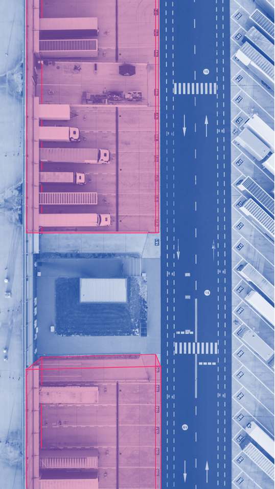
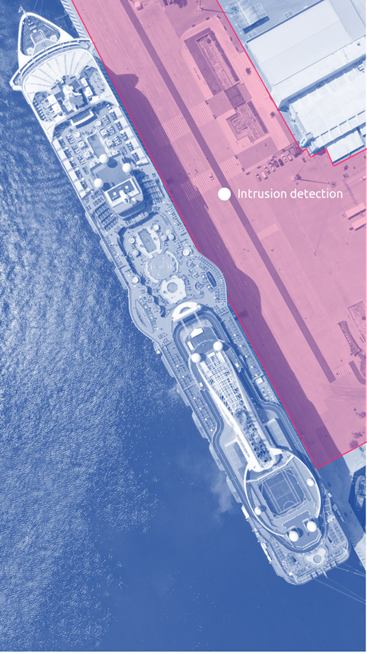

# 3. Applications and use-cases

> The need for cost-efficient and robust surveillance is increasingly growing and at the same time, Flasheye wants to ensure integrity and privacy. 3D LiDAR surveillance provides immediate detection of deviations compared to the desired situation, and accurate tracking of intruders without breaching GDPR since the point clouds of individuals cannot be identified. This information can be used to make better decisions and faster actions, or instruct PTZ cameras within the monitored private property.

## Intruder tracking 
The LiDAR data is used to generate a 3D model, a point cloud, that makes it possible to track and detect moving objects in the sensor’s field of vision. This is done by grouping points together in clusters that appear to belong together based on mathematical rules. The dynamic point clusters are constantly updated by comparing the point cloud (usual sensor refresh being 10-20Hz) to the static environment that is first saved as a reference. In the event of brief disturbances, the tracked objects are kept in memory in order to be able to preserve unique objects with their own ID code, and to quickly capture previously discovered objects that are most likely the same objects.

## Recognition of people and vehicles
To reduce the occurrence of false alarms, the solution understands each situation, where the central part is to be able to detect and distinguish the most common objects, for example people and vehicles. This is done through a combination of rule-based detection (recognizing motion and size) and supervised AI using LiDAR’s 2D projection output. This makes object recognition more accurate since point cloud analysis with LiDAR and neural network analysis of 2D images have different properties and advantages. It is also possible to set the analysis sensitivity depending on what information is most important to obtain.

## Support and collaborate with PTZ camera
A competitive combination is to use LiDAR for early detection and provide instructions to a PTZ camera to be pointed in that direction. This enables additional validation using camera images before actions are initiated. Two technologies with different benefits and characteristics that complement each other. LiDAR sensors have the important benefit of not being sensitive to light, darkness, adverse weather, and have long range.

## Filtering small animals and birds
It is easy to filter out small objects, since everything in a point cloud is already in precisely measured 3D and all analysis logic consists of shapes, sizes and movements. Very small disturbance objects do not fill enough volume and are automatically filtered.

## Self-diagnosis
In order to achieve reliable performance, the solution itself needs to understand if any deviation occurs in the form of a changed sensor position, loss of points, dirt on the sensor, etc. In the event of such deviations, a notification is sent for corrective action by the alarm operator. Other diagnostic features make the configuration secure by monitoring if there is permanent shading in a virtual 3D box, or 
overlap that may be causing problems. 

## Counting intruders and objects
Once an object has been discovered and tracked, it needs to be continuously tracked with a unique ID, in order to be able to calculate whether an object is added or removed. This also applies to multi-installations where all analysis takes place in the common point cloud regardless of how many LiDAR sensors the system has. It is recommended that the sensors overlap somewhat in their fields of view, but it is possible to calibrate sensors in a common point cloud even without overlap by registering them into a previously recorded 3D model of the monitored area. It depends on the unique environment how difficult it is to cover the whole area with synchronized LiDAR sensors and how long you can save an ID if it temporarily disappears. Since LiDAR sensors are usually mounted in elevated positions, much of obscuring by structures can be avoided.

## Free escape routes and exits
Another application for safety in buildings and industrial facilities is to receive warnings if escape routes are obscured or blocked. This is done by saving a reference image of what the environment should look like in the desired case. Then you can allow people to move within the area, but if something is left in the escape routes and exits for a configurable amount of time, an alarm is generated. 

## Detect potentially dangerous objects
In highly populated areas, such as airports, it can be a danger if objects are left unattended. This can be quickly detected by people being tracked and compared to the saved reference image. This function together with the PTZ camera could quickly provide information about the situation where an operator can determine whether something deviating appears with the left object.

    

## Masking out disturbing trees and other vegetation
To reduce the risk of false alarms, you can create virtual masking boxes, in areas where you want to ignore movements such as swaying tree branches, shrubs and other moving vegetation. The same applies to windows where reflections could cause mirrored copies of real objects. This is a great solution for any unique environment that may have different movements that may be misunderstood as important changes. In the LiDAR sensor's field of view, you can have as many virtual 3D boxes and masking boxes as you need, which enables an active monitoring that suits the environment. The same functionality (masking out areas that should be ignored) can be used to restrict monitoring to a specific area within the broad field of view of the sensor, e.g., a small enclosed garden. 