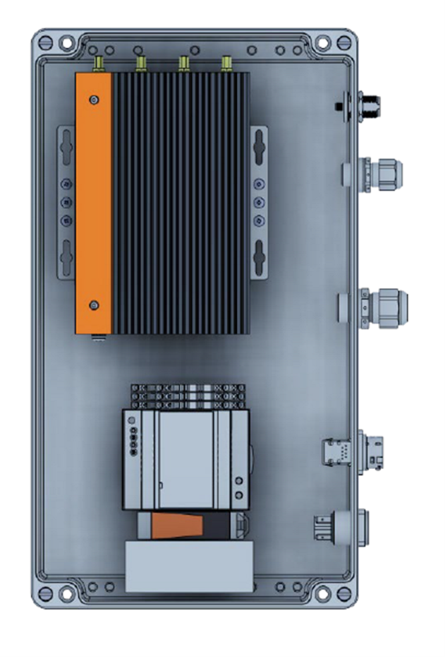

# 4. Security System Scalability

> The Flasheye security solution can be set-up and installed either as a single-sensor security system or a multi-sensor security system depending on the area to be covered, environment and several other factors depending on the customers' requirements. 

## Single-sensor security system
For single installations, Flasheye's rugged LiDAR processing unit (IP65) can be used. The LPU is powered by mains AC (110-230V) and can communicate over Gigabit Ethernet, Wifi (option), or 4G (option). All analysis is run locally on either the server or an LPU, in real time. Flasheye's server and LPU solutions are based on high quality industrial computers, such as the rugged, wide temp range and fanless OnLogic Karbon 400 or the OnLogic MK200 rack server series.

## Multi-sensor security system
For multi-installations with several sensors, PoE++ cabling and server rack can cover distances between sensor and server up to 240m (or practically unlimited with fiber). The server solution is necessary when you have several LiDAR sensors want to aggregate and synchronize the point clouds, meaning all the LiDAR’s have one common point cloud and coordinate system. 

## System security
Flasheye is always striving towards the highest security level in the products and solutions and is continuously working with modelling of security threats in the system and in the products. Modelling of security threats is a process to evaluate and document a system’s security risks identifying potential threats, understand the threats, categorize the threats, and analyze and eliminate potential limitations. Flasheye’s system is based on 3rd parties’ products and components from certified suppliers and manufacturers and the software is based on open standards, internet architecture, and standard security mechanisms. Flasheye’s LiDAR sensors are physically connected to the Flasheye LPU, alternatively connected to a server solution through a PoE splitter box that converts PoE to the dedicated rugged cable of the LiDAR sensor. 